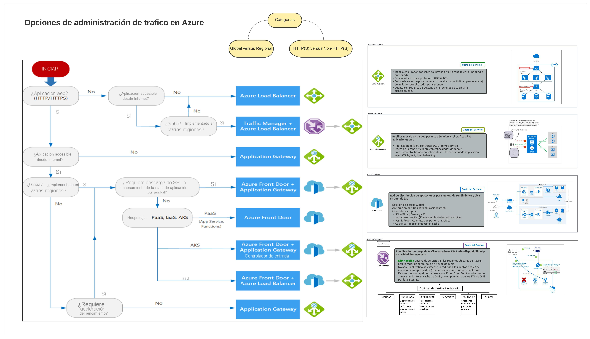

<h1 align="center">Azure Share</h1>

Este repositorio contiene una colección de imágenes utilizadas en mis publicaciones de LinkedIn sobre Azure, el servicio de nube de Microsoft. Estas imágenes incluyen diagramas de arquitectura, capturas de pantalla, infografias, entre otros.

Contribución
Si te gustaría contribuir a este repositorio, por favor revisa las Pautas de Contribución que hemos proporcionado.

Licencia
A menos que se indique lo contrario, las imágenes de este repositorio están bajo la licencia MIT. Ver el archivo LICENSE para más detalles.

Contacto
Si tienes alguna pregunta o comentario, por favor no dudes en ponerte en contacto conmigo.

<h2>Contenido</h2>  

El repositorio está organizado por categorías para facilitar la búsqueda de imágenes. Las categorías incluyen:

El repositorio cuenta con la imagen en alta resolucion utilizada en el post realizao en su momento. Este es un listado del orden de las publicacaciones:

---

<!----------------------------------------------Publicación 2-------------------------------------------------------->

<h3 align="center">Publicación 2</h3>

**[Publicación de Linkedin](https://www.linkedin.com/posts/chernandez314_azurecloud-azure-activity-7075233325119877120-3LGW?utm_source=share&utm_medium=member_desktop)**

**Habla sobre:** Opciones en Azure para la administración de trafico.

</n></n>

:camera: [AZURE-administracionDeTrafico.jpeg](AZURE-administracionDeTrafico.jpeg)

&nbsp;&nbsp;

---

<!----------------------------------------------Publicación 3-------------------------------------------------------->

<h3 align="center">Publicación 1</h3>

**[Publicación de Linkedin](https://www.linkedin.com/posts/chernandez314_azurecloud-azure-activity-7075233325119877120-3LGW?utm_source=share&utm_medium=member_desktop)**

**Habla sobre:** Microsoft XDR es un servicio de Azure que utiliza IA para detectar y responder a amenazas cibernéticas, mejorando la seguridad de las organizaciones.

</n></n>

:camera: [MicrosoftSecurity-XDR.pdf](MicrosoftSecurity-XDR.pdf)

&nbsp;&nbsp;

---

<!-------------------------------------------------------------------------------------------------------------------->

